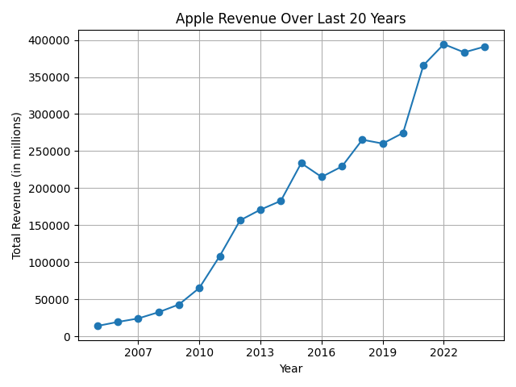

# 🤖 Finance AI — Chat App with Graph Support

A lightweight chat interface powered by an AI backend for answering finance-related questions. 

Automatically displays AI-generated responses and renders graphs when provided.

## 🎬 Demo

https://raw.githubusercontent.com/JiaGengChang/fin-ai/main/assets/demo.mov

## 📦 Getting Started

### 1. Clone the Repository

```bash
git clone https://github.com/your-username/finance-ai.git
cd finance-ai/frontend
```

### 2. Install requirements

```bash
cd ../backend
pip install -r requirements.txt
```

### 3. Database and keys
Modify the .env file as follows:

*  OPENAI_API_KEY: your own API key from OpenAI.

*  MYSQL_[USER|PASSWORD]: of the MySQL server user e.g. root

*  MYSQL_HOST: hostname of MySQL server e.g localhost

*  DB_URI - format is `mysql+mysqlconnector://<user>:<password>@<address>:<port>/<db-name>`


### 4. Start backend server

(Start the MySQL server if you haven't done so already)

```bash
uvicorn server:app --reload
```

Ensure it runs on http://localhost:8000

### 5. Launch frontend

```bash
# On macOS
open frontend/index.html

# On Windows
start frontend/index.html
```

You can now start chatting with the AI!

## 🖼️ Examples

- Ask about Apple's revenue 

    

